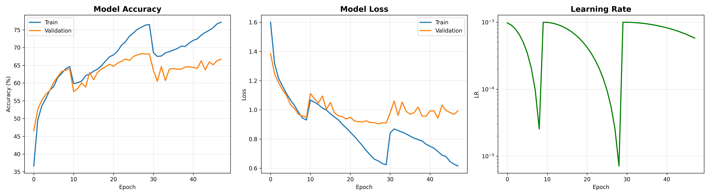
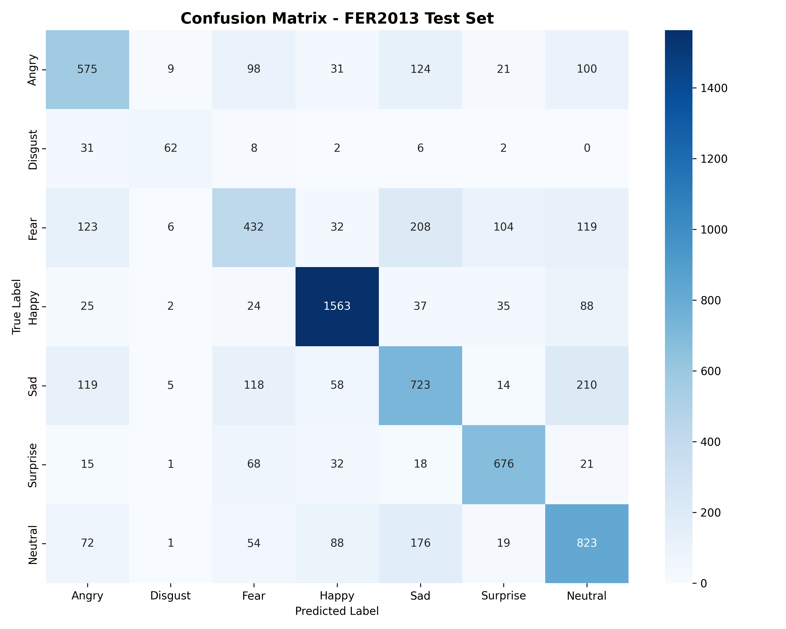

# Expression Analysis

A CNN trained on FER2013 to classify facial expressions into 7 categories:
angry, disgust, fear, happy, sad, surprise, neutral.

Test accuracy: **67.6%**. For context, human agreement on FER2013 labels
is usually cited around 65-70%, so this is close to what the dataset
itself allows for — the ceiling here is mostly the labels, not the model.

## Results





Per-class recall on the test set:

| Class    | Recall | Notes |
|----------|--------|-------|
| Happy    | 88.1%  | Easiest class by far — smiling is a strong, distinctive signal even at 48x48 |
| Surprise | 81.3%  | Raised eyebrows / open mouth are also fairly unambiguous |
| Neutral  | 66.7%  | Mostly clean, some leakage into sad |
| Angry    | 60.0%  | Confused with fear and neutral |
| Sad      | 58.0%  | Confused with neutral and angry |
| Disgust  | 55.9%  | Smallest class in the dataset (111 test images vs. 1700+ for happy) |
| Fear     | 42.2%  | Weakest class — spreads across angry, sad, surprise, and neutral almost evenly |

Fear is the clear problem class, and it's a known FER2013 issue, not
something specific to this model: fear/sad/angry look genuinely similar in
grayscale at 48x48, and FER2013's labels are noisy enough that even human
annotators only agree with the dataset label about 65% of the time on this
class. More capacity or better augmentation only gets you so far when the
ceiling is the labeling.

## Architecture

Four conv blocks (64 → 128 → 256 → 512 channels), each two 3x3 convs with
batch norm, ReLU, and max pooling, followed by two fully-connected layers
(512 → 256 → 7). ~10M parameters.

Dropout scales with depth: 0.1 in the first block up to 0.3 in the last
conv block and both FC layers. Flat dropout across all layers was tried
first and underperformed — early layers learn generic edge/texture
features and don't need much regularization, so knocking out 25-50% of
them was mostly just slowing down training without helping generalization.

Training setup:
- Adam, lr=5e-3, weight decay 1e-4
- Cosine annealing with warm restarts (`T_0=10, T_mult=2`) instead of a
  flat LR or plain ReduceLROnPlateau — the restarts noticeably helped the
  model escape a couple of plateaus that a monotonic schedule got stuck on
- Gradient clipping (max norm 1.0)
- Early stopping on validation accuracy, patience 20
- Light augmentation only: ±10° rotation, horizontal flip. Heavier
  augmentation (affine shifts, random resized crop) was tried and made
  things worse — see `experiments/README.md`

## Repo structure

```
src/
  model.py       # EmotionCNN definition
  dataset.py     # FERDataset + transforms + loader setup
  engine.py       # train/val loops, evaluation, plotting
  train.py       # CLI entry point for training
  predict.py     # CLI entry point for single-image inference
results/          # training curves + confusion matrix from the run above
experiments/      # earlier Keras and PyTorch attempts, kept for reference
```

## Setup

```bash
pip install -r requirements.txt
```

## Dataset

Uses [FER2013](https://www.kaggle.com/datasets/msambare/fer2013) in its
image-folder form (not the original single CSV). Download it and arrange
it as:

```
fer2013/
  train/
    angry/    *.jpg
    disgust/
    fear/
    happy/
    sad/
    surprise/
    neutral/
  test/
    (same 7 folders)
```

## Training

```bash
python src/train.py --data-dir /path/to/fer2013 --epochs 100
```

Checkpoints go to `checkpoints/` (best model by validation accuracy, plus
a final checkpoint with optimizer state and history). Both are gitignored
— they're 45-85MB each, which doesn't belong in git history. If you need
to share a trained model, use GitHub Releases or a model registry instead.

Useful flags: `--batch-size`, `--lr`, `--weight-decay`, `--patience`,
`--checkpoint-dir`, `--results-dir`. Run `python src/train.py --help` for
the full list.

## Inference

```bash
python src/predict.py --image path/to/face.jpg --checkpoint checkpoints/best_fer2013_model.pth
```

Prints the predicted label and confidence, and pops up a bar chart of all
7 class probabilities. Add `--no-show` to skip the plot (e.g. for
scripting).

## What I'd try next

- **Class weighting or focal loss** for disgust, which is underrepresented
  by roughly 10x compared to happy — right now the model just doesn't see
  enough of it to learn a sharp decision boundary
- **A held-out calibration check** — the model's confidence on
  misclassified fear images is worth looking at specifically, since that's
  where most of the errors concentrate
- **Transfer learning from a face-pretrained backbone** (e.g. a model
  pretrained on VGGFace2) instead of training from scratch — FER2013 is
  small enough that this would likely help more than further architecture
  tweaks
